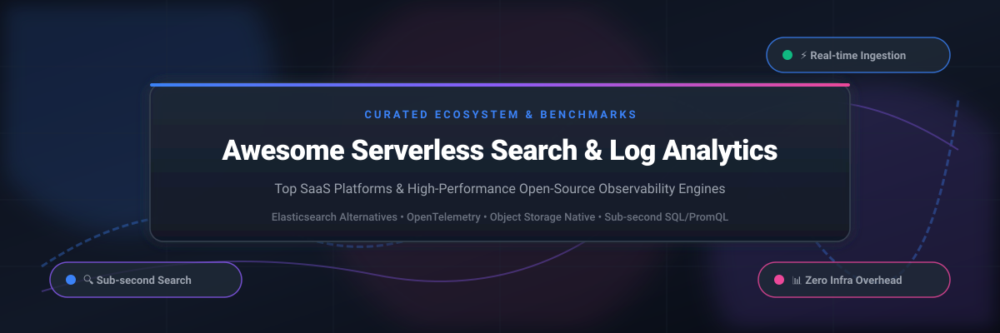

# ⚡ Awesome Serverless Search & Log Analytics 🔍

 

## 🚀 Top Serverless Search & Log Analytics Ecosystem

**Curated List of SaaS Products & Open-Source GitHub Projects**  
*Focused on Log Aggregation, Search Analytics & Self-Hosted Observability Backends*  

**Last updated: October 2026** 📅

This repository tracks notable **commercial search and log analytics platforms** and **open-source projects** that ingest, index, search, and visualize logs and events at scale. These tools power observability, security analytics, and operational intelligence — with serverless options that scale without infrastructure management. ⚡

---

## 📈 Sector Market Overview

> 💡 **Market Size & Fragmentation**: The global log analytics and search market is estimated at **~$7.2 Billion (2026)** and projected to exceed **$14.5 Billion by 2030** (CAGR ~19%). The market is **moderately fragmented**: hyper-scalers (AWS, Elastic, Datadog) command top-tier enterprise share, while specialized serverless platforms (Axiom, Better Stack, Hydrolix) and open-source innovations (OpenObserve, Quickwit, SigNoz) rapidly capture market share with 10x-140x cost-efficiency on object storage.

---

## 📑 Table of Contents

- [☁️ SaaS/Hosted Platforms](#️-saashosted-platforms)
- [📦 Open-Source GitHub Projects](#-open-source-github-projects)
  - [🔍 Search & Log Analytics Engines](#-search--log-analytics-engines)
  - [📊 Log Management & Observability](#-log-management--observability)
- [🤝 How to Contribute](#-how-to-contribute)
- [⭐ Star History](#-star-history)
- [💖 Support & Community](#-support--community)
- [⚠️ Disclaimer](#️-disclaimer)

---

## ☁️ SaaS/Hosted Platforms

| Platform 🌐 | Scale / Valuation 💰 | Starting Pricing 💵 | Free Tier / Trial Limit 🎁 | Best For 🎯 | Description 📝 |
| :--- | :--- | :--- | :--- | :--- | :--- |
| **[Amazon OpenSearch Serverless](https://aws.amazon.com/opensearch-service/)** | ~$2.4 Trillion (AWS Parent Market Cap) | $0.24 per OCU-hour (indexing/search) + $0.024/GB-month storage | 14-Day Free Trial (up to 10 OCU-hours/day + 10 GB storage free) | AWS-native log analytics | AWS's serverless search & log analytics — auto-scales for unpredictable workloads without cluster management. |
| **[Elastic Cloud Serverless](https://www.elastic.co/)** | ~$9.8 Billion (Market Cap) | $0.095/GB ingested + compute consumption | 14-Day Free Trial (includes $300 free cloud credits) | Elastic ecosystem users | Elastic's fully managed serverless offering for Elasticsearch, Kibana, and observability. |
| **[Logz.io](https://logz.io/)** | ~$250 Million (Estimated Valuation) | $1.09 / GB ingested per month | Free Forever Tier (1 GB/day ingestion, 1-day retention) | Unified observability | Cloud observability platform — log management, metrics, and tracing built on OpenSearch. |
| **[Coralogix](https://coralogix.com/)** | ~$400 Million (Valuation) | $0.14 / GB ingested (TCO-optimized storage tier) | 14-Day Free Trial (Full feature access, 30 GB ingest) | Enterprise observability | Observability platform with streaming analytics — logs, metrics, and traces with cost optimization. |
| **[Better Stack](https://betterstack.com/)** | ~$150 Million (Estimated Valuation) | $0.25 / GB ingested per month | Free Forever Tier (1 GB/month ingestion, 3-day retention) | Modern log analytics | Log management & uptime monitoring — SQL-compatible log querying with live tail and instant setup. |
| **[Axiom](https://axiom.co/)** | ~$80 Million (Estimated Valuation) | $0.25 / GB ingested per month | Free Forever Tier (50 GB/month ingestion, 30-day retention) | High-volume log analytics | Serverless log analytics — unlimited ingest, sub-second queries, and cost-effective storage. |
| **[Mezmo](https://www.mezmo.com/)** | ~$70 Million (Estimated Valuation) | $1.20 / GB ingested per month | 14-Day Free Trial (Full telemetry pipeline & log analysis access) | Telemetry pipelines | Telemetry data pipeline and log analytics — control, enrich, and route observability data. |
| **[Hydrolix](https://hydrolix.io/)** | ~$50 Million (Estimated Valuation) | $0.45 / GB ingested (BYOC / Cloud Marketplace) | 30-Day Free Trial (or AWS Marketplace POC credits) | Long-term log retention | High-density data platform — cost-effective log retention & sub-second query performance at scale. |
| **[Quickwit Cloud](https://quickwit.io/)** | ~$20 Million (Seed-backed Valuation) | $0.10 / GB ingested per month | Free Forever Tier (10 GB/month ingestion, 7-day retention) | Cost-effective log search | Managed Quickwit backend — sub-second search directly on object storage with 10x savings. |
| **[Baselime](https://baselime.io/)** | ~$15 Million (Acquired by Cloudflare) | $0.20 / GB ingested per month | Free Forever Tier (5 GB/month ingestion, 7-day retention) | Serverless-first teams | Serverless observability platform — logs, metrics, and traces tailored for serverless architectures. |

---

## 📦 Open-Source GitHub Projects

### 🔍 Search & Log Analytics Engines

- **[Meilisearch](https://github.com/meilisearch/meilisearch/stargazers)**   
  ⚡ **Lightning-fast search engine**, MIT licensed. Typo-tolerant, faceted search with instant results. The leading open-source Algolia alternative. **Best for application search** 🎯.

- **[Grafana Loki](https://github.com/grafana/loki/stargazers)**   
  🔥 **Horizontally scalable log aggregation**, AGPL-3.0 licensed. Cost-effective log storage by indexing labels, not full text. Integrates seamlessly with Grafana for visualization. The standard for Kubernetes log aggregation. **Best for cloud-native log aggregation** 🎯.

- **[Typesense](https://github.com/typesense/typesense/stargazers)**   
  💡 **Open-source typo-tolerant search engine**, GPL-3.0 licensed. Fast, relevant, and easy to deploy in-memory search engine. **Best for site search and e-commerce** 🎯.

- **[OpenObserve](https://github.com/openobserve/openobserve/stargazers)**   
  🚀 **Open-source observability platform**, AGPL-3.0 licensed. Single binary for logs, metrics, and traces with 140x lower storage costs than Elasticsearch using Parquet columnar format and S3-native architecture. Native OTLP support, SQL, and PromQL query languages. **Best for cost-effective unified observability** 🎯.

- **[OpenSearch](https://github.com/opensearch-project/OpenSearch/stargazers)**   
  🌐 **The leading open-source search & analytics suite**, Apache-2.0 licensed. Apache-licensed fork of Elasticsearch 7.10 — community-driven full-text search, log analytics, and security analytics. Used by AWS, SAP, and thousands of enterprises. **Best for search and log analytics at scale** 🎯.

- **[Quickwit](https://github.com/quickwit-oss/quickwit/stargazers)**   
  🦀 **Sub-second search on object storage**, Apache-2.0 licensed. Rust-based search engine for logs with decoupled compute and storage. 10x cheaper than Elasticsearch for log storage on Amazon S3 / GCS. **Best for long-term log retention on object storage** 🎯.

- **[Apache Solr](https://github.com/apache/solr/stargazers)**   
  🏛️ **The veteran enterprise search platform**, Apache-2.0 licensed. Enterprise-grade full-text search, faceting, spatial search, and analytics engine. **Best for enterprise search** 🎯.

---

### 📊 Log Management & Observability

- **[SigNoz](https://github.com/SigNoz/signoz/stargazers)**   
  📈 **Open-source APM & observability platform**, Apache-2.0 licensed. Logs, traces, and metrics in one application — native OpenTelemetry support. **Best for unified observability** 🎯.

- **[Apache Doris](https://github.com/apache/doris/stargazers)**   
  ⚡ **Real-time analytical database**, Apache-2.0 licensed. High-performance real-time log analytics and dashboarding engine. **Best for real-time analytics** 🎯.

- **[Graylog](https://github.com/Graylog2/graylog2-server/stargazers)**   
  🛡️ **Centralized log management**, SSPL licensed. Powerful search, live log streams, pipeline processing, and alerting. **Best for log management with SIEM capabilities** 🎯.

- **[OpenSearch Dashboards](https://github.com/opensearch-project/OpenSearch-Dashboards/stargazers)**   
  🎨 **Data visualization platform for OpenSearch**, Apache-2.0 licensed. Kibana-compatible dashboards and log analytics UI. **Best for OpenSearch visualization** 🎯.

- **[Uptrace](https://github.com/uptrace/uptrace/stargazers)**   
  📌 **Open-source APM & distributed tracing**, AGPL-3.0 licensed. OpenTelemetry-based distributed tracing, metrics, and log aggregation. **Best for cost-effective APM** 🎯.

---

### 🌟 Additional Strong Open-Source Options

- **[Apache Lucene](https://github.com/apache/lucene/stargazers)**  — Core Java full-text search engine library powering Elasticsearch, Solr, & OpenSearch ☕.
- **[Vespa](https://github.com/vespa-engine/vespa/stargazers)**  — Yahoo's open-source big data processing & vector search engine 🎯.
- **[Sonic](https://github.com/valeriansaliou/sonic/stargazers)**  — Super-fast & lightweight search backend written in Rust 🦀.
- **[ZincSearch](https://github.com/zincsearch/zincsearch/stargazers)**  — Lightweight, low-resource Elasticsearch alternative written in Go 🐹.
- **[Bleve](https://github.com/blevesearch/bleve/stargazers)**  — Modern text indexing and search engine library for Go 🐹.
- **[Apache Cassandra](https://github.com/apache/cassandra/stargazers)**  — Distributed NoSQL database for ultra-high throughput log storage 🗄️.

---

## 🛠️ Frameworks & Architecture Recommendations

- Combine **OpenSearch** for full-featured search, security analytics, and enterprise log processing.
- Use **Quickwit** for ultra cost-effective log search directly on S3 / Google Cloud Storage.
- Deploy **OpenObserve** for single-binary unified observability (logs, metrics, traces) with 140x lower storage overhead.
- Choose **Grafana Loki** for Kubernetes-native log aggregation integrated into Grafana dashboards.
- Integrate **Meilisearch** or **Typesense** for instant, typo-tolerant in-app search.
- Use **SigNoz** or **Uptrace** for OpenTelemetry-native APM and distributed tracing.

---

## 🤝 How to Contribute

1. Fork the repository 🍴.
2. Add/edit entries in [README.md](README.md) following the existing structured format.
3. Include: Name, link, 1–2 sentence description, pricing/stars, and category.
4. Check out curated awesome resources at [Awesome-Awesome-Awesome](https://github.com/ishandutta2007/Awesome-Awesome-Awesome) 🌟.
5. Submit a Pull Request (PR) with a clear explanation!

---

## ⭐ Star History

---

## 💖 Support & Community

Thank you for exploring and using **Awesome Serverless Search & Log Analytics**! 🚀  

If you find this repository helpful, please consider supporting the project:
- 🌟 **Star this repository** on GitHub to increase visibility!
- 🔀 **Fork it** and contribute your favorite tools or insights.
- 📢 **Share it** with fellow DevOps, SRE, and software engineers!

---

## ⚠️ Disclaimer

- This is a **community-curated list** — not exhaustive and not an endorsement.
- Log analytics platforms ingest sensitive operational data including application logs, security events, and potentially PII. Self-hosted solutions require proper security hardening, access controls, and compliance with data privacy regulations.
- **License considerations**: OpenSearch uses Apache-2.0, OpenObserve uses AGPL-3.0, Loki uses AGPL-3.0, and Graylog uses SSPL. Verify licensing against your use case before committing 📜.
- **Storage costs dominate log analytics**: Elasticsearch can be expensive for long-term retention. Quickwit and OpenObserve offer 10x-140x lower storage costs by using object storage and Parquet columnar formats 💾.
- **Full-text search vs. label-based indexing**: OpenSearch indexes full text for detailed queries; Loki indexes only labels for cost efficiency. Choose based on your query patterns 🔍.

---

<b>Made with ❤️ for SREs, observability engineers, and software architects.</b>  
Let's make serverless search and log analytics more open, transparent, and cost-effective! 🌟

